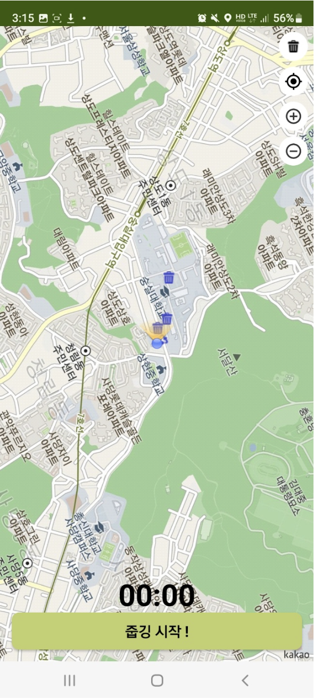

# 함께줍깅

## 기획 의도
COVID-19의 장기화에 따라 운동이 개인에 미치는 영향의 중요성 및 필요성이 환기되었다. 

또한 이상기후 현상이 빈번하게 발생함에 따라 환경 보호 실천의 중요성이 강조됐다.

이 서비스는 플로깅 활동의 진입 장벽을 낮추어 지속적인 참여를 장려하고 플로거의 건강과 지역 환경 개선에 기여하고자 본 애플리케이션을 기획하게 됐다.

결과적으로 “함께줍깅” 서비스를 통해 개인이 건강해지고, 지역 사회를 보다 깨끗한 환경으로 만들어 환경보호를 이끌고자한다.

## 시연 영상
https://www.youtube.com/watch?v=pA0kIA1dKKI

## ERD

## 프로젝트 아키텍처

## 주요 기능
### 1. 기록 조회 및 예약 확인

### 2. 줍깅(플로깅)

(1) 지도에 어디에 쓰레기통이 있는지 확인 가능  
    + 일반, 담배꽁초, 재활용 구분  

(2) 사용자가 쓰레기통 등록 가능

(3) 플로깅 종료 화면 <-> 인스타그램 스토리 연동

### 3. 커뮤니티

## 소프트웨어 기획서
(1) 로그인, 포인트샵, 랭킹 및 주요 기능 설명

(2) 유즈케이스 다이어그램

(3) 프로토타입

(4) 개발환경

등의 추가적인 설명이 담겨져있는 기획서를 첨부합니다.

[소프트웨어 기획서.pdf](./img/plogging.pdf)
